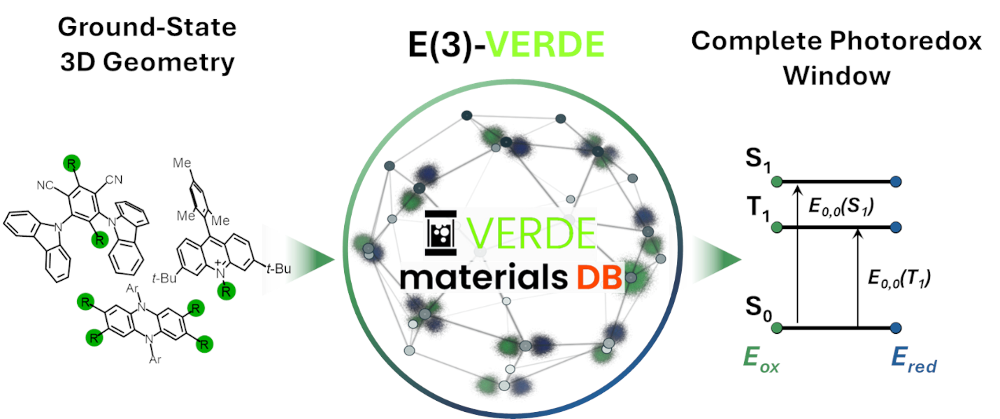

# E(3)-VERDE

**E(3)-VERDE: A 3D-Equivariant Neural Network for the Complete Ground- and Excited-State Redox Landscape of Organic Photocatalysts**

Andres C. Lopez, Leticia A. Gomes, and Steven A. Lopez*  
Department of Chemistry & Chemical Biology, Northeastern University, Boston, MA 02115, USA

<p align="center">
  
</p>

Implementation of **E(3)-VERDE**: an E(3)-equivariant GNN ([e3nn](https://e3nn.org/)) for ground- and excited-state redox properties of organic photocatalysts from 3D structures.

| Document | Contents |
|----------|----------|
| [tutorial/README.md](tutorial/README.md) | **How to predict on your molecules** (start here) |
| [DOCUMENTATION.md](DOCUMENTATION.md) | Full config reference, dataset format |
| [data_/README.md](data_/README.md) | Paper checkpoints (8 targets) |
| [CITATION.cff](CITATION.cff) | Citation metadata |
| [LICENSE](LICENSE) | MIT license |

## Which folder should I use?

There is **one tutorial** (`tutorial/README.md`). The other folders are **configs + data**, not extra tutorials. They look similar because each property needs a JSON file — but each folder has a different job.

| I want to… | Folder | Example command |
|------------|--------|-----------------|
| **Predict on my XYZ** (start here) | `tutorial/` | `python -m e3verde.run tutorial/configs/new_molecules/oxS0.json` |
| Reproduce **paper** workflows (8 targets) | `data_/` | `python -m e3verde.run data_/predict/oxS0/config_predict.json` |
| Start a **custom** train/HPO/LC from a blank template | `configs/` | Copy `configs/train.json`, edit, then run |
| Read **technical** details (all JSON fields) | `DOCUMENTATION.md` | — |
| **Run outputs** (CSV, logs, plots) | `data/` | Auto-created; not in GitHub |

```
e3verde/          ← code only (no docs inside)
tutorial/         ← user guide + example XYZ + predict configs
data_/            ← paper checkpoints + paper configs (8 targets × 4 workflows)
configs/          ← generic JSON templates (any target)
data/             ← your local results (gitignored)
```

**Why several config folders?** They are not duplicates of the same tutorial:
- **`tutorial/configs/`** — paths set for newcomers (`verde_mini.json`, `tutorial/my_molecules/`).
- **`data_/<workflow>/<target>/`** — exact paper settings per property (`oxS0`, `redT1`, …).
- **`configs/`** — one generic file per workflow type to copy when you define a **new** target.

**Checkpoints** live only in `data_/predict/<target>/verde_best.pt`. Train configs save to the same path when you retrain.

---

Everything below ships with the clone — **documentation, code, figures, and data needed to predict** without the full training database.

| Included | Path | Purpose |
|----------|------|---------|
| **Main README** | `README.md` | This file |
| **Tutorial** | `tutorial/README.md` | Step-by-step guide (predict on your molecules) |
| **Technical docs** | `DOCUMENTATION.md` | Config reference, JSON dataset format, outputs |
| **Paper archive docs** | `data_/README.md` | Index of the 8 paper checkpoints |
| **Graphical abstract** | `Picture1.png` | Figure in the README above |
| **Citation** | `CITATION.cff` | Metadata for citing the software |
| **License** | `LICENSE` | MIT |
| **Source code** | `e3verde/` | Library + CLIs (`run`, `hpo`, `learning_curve`) |
| **Example configs** | `configs/` | Generic JSON templates ([configs/README.md](configs/README.md)) |
| **Tutorial data** | `tutorial/my_molecules/`, `tutorial/configs/`, `tutorial/data/verde_mini.json` | 3 example XYZ + 8 predict configs + mini DB (~80 molecules) |
| **Paper checkpoints** | `data_/predict/*/verde_best.pt` | Pre-trained models (8 properties) — single copy |
| **Paper configs** | `data_/train/`, `data_/predict/`, `data_/hpo/`, `data_/learning_curve/` | JSON configs (`train/` = configs only; weights in `predict/`) |
| **Benchmark XYZ** | `data_/predict/xyz/` | 40 structures from paper predict runs |
| **Dependencies list** | `requirements.txt` | Python packages (PyTorch installed separately) |

**Figures from your own runs** (loss curves, parity plots, etc.) are **not** stored in the repo. They are generated locally under `data/figures/` when you train — that folder is gitignored and recreated on each run.

## What is not in this repository (paper / SI)

| Not included | Where to get it | Needed for |
|--------------|-----------------|------------|
| **Full training database** (`verde+PCs.json`) | Paper and Supporting Information | Reproducing full paper training; optional for predict |
| **Paper numerical results** (tables, SI metrics) | Manuscript and SI | Comparison with published numbers |
| **Cluster scratch** | — | Removed — was local only, never part of the published repo |

For **prediction on new molecules**, you only need what is in the repo (tutorial or `data_/predict/`).  
For **full retraining** on VERDE+PCs, download the database and place `verde+PCs.json` in the project root.

## Data availability

The VERDE+PCs training database and numerical results are described in the paper and Supporting Information. They are not bundled in this repository.

For local training, place the VERDE JSON database as `verde+PCs.json` in the project root.

To train on VERDE+PCs, your own JSON database, or a model you trained yourself, see [tutorial/README.md — Your own database and custom models](tutorial/README.md#your-own-database-and-custom-models).

## Install

Install [PyTorch](https://pytorch.org/) for your platform, then:

```bash
pip install -r requirements.txt
```

See the [PyG install guide](https://pytorch-geometric.readthedocs.io/en/latest/install/installation.html) for `torch-geometric` / `torch-scatter` wheels matching your PyTorch build.

Tested stack (cluster runs): Python 3.10+, PyTorch 2.x, `e3nn` ≥ 0.5, `torch-geometric` ≥ 2.4.

Runs on **CPU and GPU (CUDA)** — the device is chosen automatically (`Device: cpu` or `Device: cuda` in the log). See [tutorial/README.md](tutorial/README.md#cpu-and-gpu) for install notes.

Run all commands from the **repository root**.

## Usage

**Predict on new molecules** (paper models, no training data needed):

```bash
python -m e3verde.run tutorial/configs/new_molecules/oxS0.json
```

See [tutorial/README.md](tutorial/README.md) for the full step-by-step guide.

**Paper reproduction** (requires `verde+PCs.json`):

```bash
python -m e3verde.run data_/predict/oxS0/config_predict.json
python -m e3verde.run data_/train/oxS0/config_train.json
python -m e3verde.hpo data_/hpo/oxS0/config_hpo.json --n_trials 50 --hpo_epochs 60
python -m e3verde.learning_curve data_/learning_curve/oxS0/config_learning_curve.json
```

**Custom workflows** (copy templates from [configs/](configs/README.md)):

```bash
python -m e3verde.run configs/train.json
python -m e3verde.hpo configs/hpo.json --n_trials 50 --hpo_epochs 60
```

| CLI module | Purpose |
|------------|---------|
| `e3verde.run` | Train, cross-validate, or predict from a JSON config |
| `e3verde.hpo` | Optuna hyperparameter search |
| `e3verde.learning_curve` | Performance vs. training set size |

| Config location | Role |
|-----------------|------|
| `tutorial/configs/` | **Start here** — predict on your molecules |
| `data_/<workflow>/<target>/` | Paper configs + checkpoints (8 properties) |
| `configs/*.json` | Generic templates for new/custom targets |

Runtime outputs are written under `data/` (created on first run).

## Repository layout

```
README.md          Main page (this file)
Picture1.png       Graphical abstract figure
DOCUMENTATION.md   Full technical reference
CITATION.cff       Citation metadata
LICENSE
requirements.txt

e3verde/           Python package (library + CLI modules)
  run.py           CLI: train / cross_validate / predict
  hpo.py           CLI: Optuna search
  learning_curve.py CLI: learning curves
  training.py      Training loop, metrics, CV, prediction (library)
  config.py        Dataclasses and logging
  data.py          Dataset and graph construction
  model.py         Equivariant GNN
  plots.py         Figures (generated at runtime → data/figures/)

tutorial/          User guide + runnable examples
  README.md        Step-by-step tutorial (self-contained)
  my_molecules/    Example input XYZ
  configs/         Predict / train demo JSONs
  data/verde_mini.json   Small DB for tutorial (included)

configs/           Generic JSON config templates
data_/             Paper archive: checkpoints + configs (see data_/README.md)
data/              Local runtime outputs only (gitignored; not on GitHub)
```

## Citation

If you use this code, please cite the paper and [e3nn](https://e3nn.org/):

> Andres C. Lopez, Leticia A. Gomes, and Steven A. Lopez, *E(3)-VERDE: A 3D-Equivariant Neural Network for the Complete Ground- and Excited-State Redox Landscape of Organic Photocatalysts*, 2026. *(publication details TBD)*

## License

This project is released under the [MIT License](LICENSE).
